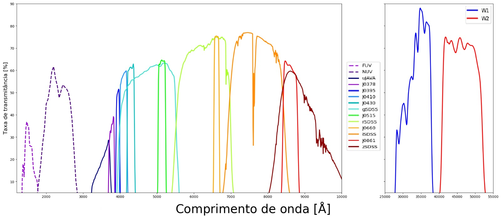
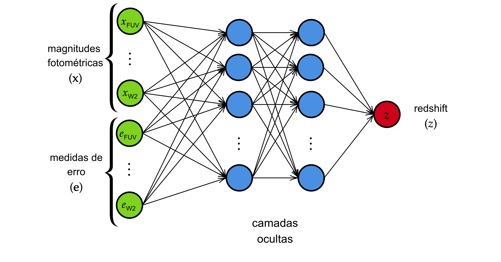

# Predição de redshifts fotométricos: utilizando erros de medida

*Redshift* é uma medida astronômica que descreve o deslocamento de uma onda eletromagnética para o espectro vermelho. Essa medida é fundamental para quantificar a distância entre o observador e objetos astronômicos (como galáxias e quasares) e também para medir como o universo se expande.

O método mais acurado para a estimação de *redshifts* é a espectroscopia. No entanto, por razões de custo e tempo, uma alternativa que vem sendo cada vez mais investigada é a estimação por fotometria. Nesse contexto, é mensurada a quantidade de luz que um objeto astronômico emite em determinados intervalos de comprimento de onda. Além disso, é possível mensurar uma grandeza de incerteza associada a essas quantidades de luz.

Tradicionalmente, essas medidas fotométricas são utilizadas como covariáveis para a predição do *redshift* de um objeto. No entanto, as medidas de erro geralmente são descartadas nesses estudos. Diante disso, este projeto tem como foco a investigação de métodos de aprendizado de máquina que buscam incorporar medidas de incerteza para estimação de *redshifts*, utilizando dados de quasares do [S-PLUS (*Southern Photometric Local Universe Survey*)](https://www.splus.iag.usp.br/).

---

# Conjunto de dados

O levantamento de dados fotométricos de quasares realizado pelo [S-PLUS](https://www.splus.iag.usp.br/) se destaca por utilizar um sistema fotométrico de 12 filtros passa-banda, chamado *Javalambre*. Esse sistema possui sete filtros a mais do que a maioria dos levantamentos astronômicos convencionais. Esses sete filtros adicionais, mais estreitos e estrategicamente selecionados, têm a finalidade de viabilizar o estudo de características específicas denominadas linhas espectrais. Além disso, o levantamento contém informações de magnitudes fotométricas do catálogo [unWISE](https://catalog.unwise.me/) (W1 e W2) e do catálogo [GALEX](https://www.galex.caltech.edu) (FUV e NUV) (OLIVEIRA et. al, 2019) totalizando, assim, 16 filtros.

Cada objeto astronômico tem uma tripla associada: $(\mathbf{x}, \mathbf{e}, z)$

Onde:

- **$\mathbf{x}$**: Magnitudes fotométricas para cada um dos 16 filtros;
- **$\mathbf{e}$**: Medidas de erro;
- **$z$**: *Redshift*.

---

# Primeira abordagem:

A abordagem mais simples para integrar as medidas de erro a uma rede neural artificial consiste em adicionar as medidas de erro à camada de entrada, junto às outras covariáveis.

No entanto, essa abordagem não associa explicitamente cada medida fotométrica ao seu erro correspondente; todas as covariáveis passam a ter a mesma hierarquia dentro da rede.

---

# Transformação em vetor

A ideia aqui é representar as covariáveis fotométricas (**$\mathbf{x}$**) e suas incertezas (**$\mathbf{e}$**) em um vetor unidimensional e usar uma *Rede Neural Convolucional* unidimensional para extrair padrões dessa sequência. Essa abordagem foi proposta por Rodrigues, Abramo e Hirata (2023).

Como cada filtro possui um comprimento de onda central, os vetores de entrada são ordenados pelo comprimento de onda. Isso é importante porque a rede neural convolucional explora relações espaciais na sequência — ou seja, filtros próximos em comprimento de onda ficam próximos também no vetor, preservando a estrutura física do problema.

O autor sugere três versões de organização do vetor:

## 1. **no-$\sigma$**

Dispor apenas as magnitudes fotométricas (**$\mathbf{x}$**) ordenadas no vetor, sem incluir os erros (**$\mathbf{e}$**).

## 2. **with-$\sigma$**

Dispor as magnitudes fotométricas (**$\mathbf{x}$**) no vetor seguidas pelas respectivas medidas de incerteza (**$\mathbf{e}$**), ambas ordenadas.

## 3. **stack-$\sigma$**

Dispor em canais diferentes as magnitudes fotométricas ($\mathbf{x}$) e suas respectivas medidas de incerteza ($\mathbf{e}$), ambas ordenadas.

Na versão **stack-$\sigma$**, as covariáveis estão diretamente relacionadas às suas incertezas, pois o vetor das covariáveis e o vetor de erros são sobrepostos na mesma ordem. Como as camadas convolucionais utilizam as características espaciais da entrada, a rede neural convolucional pode aprender diretamente a relação entre as medidas e suas incertezas.

---

# Transformação em matriz

Nessa abordagem, também proposta por Rodrigues, Abramo e Hirata (2023), utiliza-se um modelo de redes neurais convolucionais bidimensional.

O par $(\mathbf{x}, \mathbf{e})$ é transformado em uma matriz que representa a distribuição de probabilidade das magnitudes fotométricas. As covariáveis fotométricas são representadas nas colunas, enquanto as linhas representam os valores da distribuição de probabilidade para cada covariável.

Para isso, as covariáveis são discretizadas.

Dado:

- $\mathbf{x} = (x_1, \dots, x_d)$, vetor de $d$ covariáveis;
- $\mathbf{e} = (e_1, \dots, e_d)$, vetor de erros associado;
- $\mu_1, \dots, \mu_K$, termos médios dos intervalos de discretização;

Define-se a matriz de entrada $\mathbf{M}_{K \times d}$ por:

$$
M_{p,i} =
\frac{1}{\sqrt{2\pi} e_i}
\exp\left(
-\frac{1}{2}
\frac{(x_i - \mu_p)^2}{e_i^2}
\right)
$$

Ao representar a matriz dessa forma:

- associa-se diretamente cada magnitude à sua incerteza;
- preserva-se a ordenação segundo a transmitância dos filtros;
- incorpora-se explicitamente a natureza probabilística das incertezas.

---

# Superamostragem

Nesta abordagem, criam-se novas instâncias de covariáveis a partir dos erros associados a cada covariável.

Para cada tupla $(\mathbf{x}, \mathbf{e}, z)$, definem-se $k$ novas instâncias geradas aleatoriamente:

$$
\mathbf{y}_k := \mathbf{x} + 
N_d\left(
\mathbf{0}_d,
(\text{diag}(\mathbf{e}))^2
\right)
$$

Onde:

- $N_d(\mathbf{0}_d, (\text{diag}(\mathbf{e}))^2)$ é um vetor com $d$ observações de uma distribuição normal multivariada com média zero;
- a matriz de covariância é diagonal, formada pelos quadrados dos elementos de $\mathbf{e}$.

Assim, a tupla $(\mathbf{x}, \mathbf{e}, z)$ é substituída por $k$ pares $(\mathbf{y}_k, z)$.

Essas novas instâncias podem ser utilizadas:

- como entrada para uma rede neural artificial;
- ordenadas segundo os comprimentos de onda da transmitância;
- organizadas em vetor, formando uma versão alternativa da abordagem **no-$\sigma$**.

---

# Referências

- OLIVEIRA, C. Mendes de et al. (2019). *The southern photometric local universe survey (S-PLUS): improved SEDs, morphologies, and redshifts with 12 optical filters*. **Monthly Notices of the Royal Astronomical Society**, 489(1), 241–267.

- RODRIGUES, N. V.; ABRAMO, L. R.; HIRATA, N. S. (2023). *The information of attribute uncertainties: what convolutional neural networks can learn about errors in input data*. **Machine Learning: Science and Technology**, 4(4), 045019.
